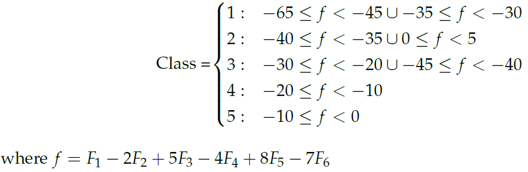
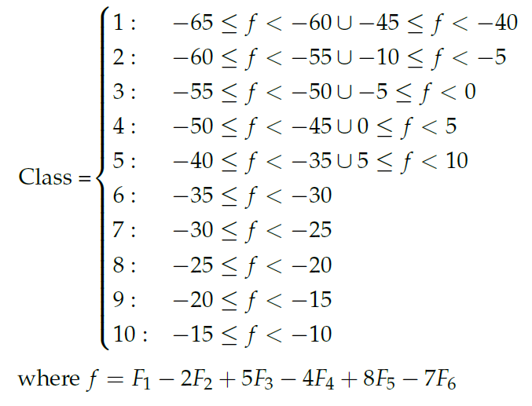

# SynthSelect
Synthetic Datasets for benchmarking feature selection algorithms as from the paper Development of Synthetic Data Benchmarks for Evaluating Feature Selection Algorithms published in MDPI <link>.

# Dataset Details
<h2>Dataset summary:</h2>

|Dataset|Relevant Features|Redundant Features|Irrelevant Features|Instances|Target Variable Equation|
|---|---|---|---|---|---|
|Straight line|2|20|100|200|F2 < F1|
|4D AND|4|8|100|100|x1 · x2 + x3 · x4|
|5D XOR|5|10|100|100|x1 ⊕ x2 ⊕ x3 ⊕ x4 ⊕ x5|
|Hypersphere|3|20|100|400|30^2 > F1^2 + F2^2 + F3^2|
|Cone|3|20|100|400|F12 + F22 > F32|
|Trigonometric|2|5|50|200|F2 < 5 sin(F1)|
|Double Spiral|3|30|120|200|Class 1: 0 ≤ z ≤ 2π x = z · cos(6z) y = z · sin(6z) Class 2: 0 ≤ z ≤ 2π x = z · cos(6(z + π/2)) y = z · sin(6(z + π/2))|
|Yin-yang|2|10|75|600|-|
|5 multi-cut|6|20|100|500|Equation 1|
|10 multi-cut|6|20|100|500|Equation 2|
<h2>Equation 1:</h2>

<h2>Equation 2:</h2>



# How To Use The Library
## How to load new data

```
from Synth_Select import load_dataset
df=load_dataset(name)
```
"name" is the name of the dataset to load. Must be either of:
<ol>
<li> '10_class_multicut'<\li> 
<li> '4D_AND'<\li>
<li> '5_class_multicut'<\li>
<li> '5D_XOR'<\li>
<li> 'cone'<\li>
<li> 'double_spiral'<\li>
<li> 'hypersphere_3D'<\li>
<li> 'trig'<\li>
<li> 'y=x'<\li>
<li> 'yinyang'<\li>
<\ol>

  
## How to add new columns
### Numeric Columns


### Categorical Columns
